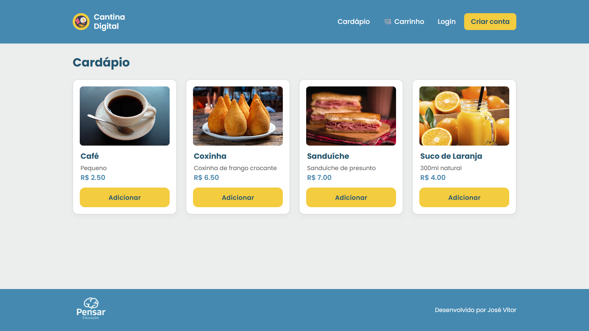
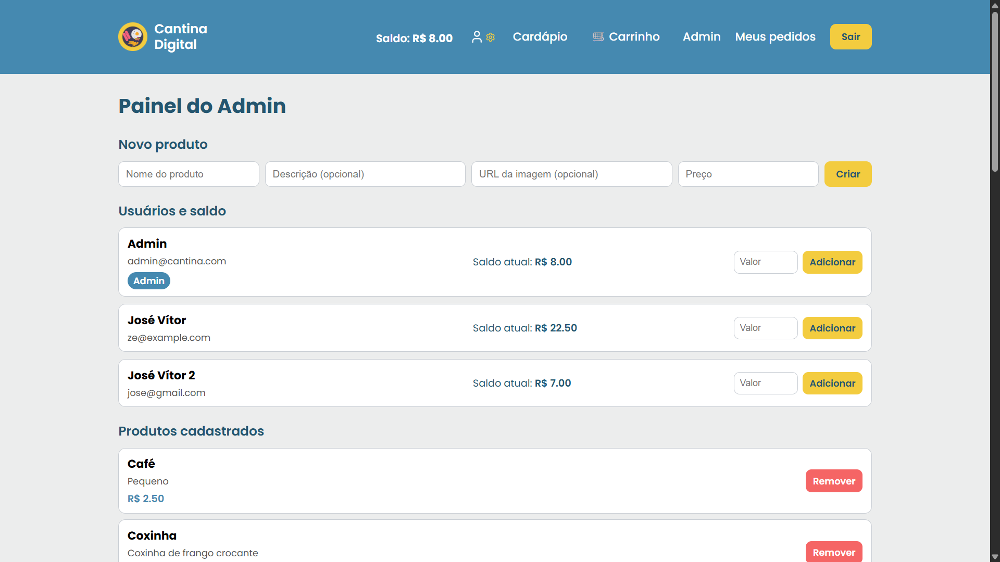

# 🍽️ Cantina Digital — Full Stack Application

<p><b>Uma aplicação completa para gestão de cantina escolar, desenvolvida como desafio técnico para o Grupo Pensar Educação.</b></p>

---

## 📘 Visão Geral

A **Cantina Digital** é uma aplicação Full Stack que moderniza o processo de compra na cantina escolar.
Ela permite que estudantes e funcionários realizem pedidos online, acompanhem seu histórico, utilizem um saldo virtual e interajam com um cardápio totalmente digitalizado.

O sistema implementa autenticação segura com JWT, controle de acesso por papéis (`user` e `admin`), carrinho de compras, histórico de pedidos e um painel administrativo completo, tudo com uma UI moderna inspirada no design institucional do Grupo Pensar Educação.

### 🖥️ Exemplos de Telas

Abaixo estão dois exemplos reais da interface da Cantina Digital:  
À esquerda o **Cardápio**, tela que é o coração da aplicação, e à direita o **Painel Administrativo**, acessível apenas para admins.

<div align="center">
  <table>
    <tr>
      <th>Cardápio</th>
      <th>Painel Administrativo</th>
    </tr>
    <tr>
      <td></td>
      <td></td>
    </tr>
  </table>
</div>

---

# ⭐ Funcionalidades Principais

## 👤 Autenticação & Segurança

* Registro de usuários com senha hasheada via **bcryptjs**
* Login seguro via JWT
* Middleware global de autenticação
* Controle de permissões (User/Admin)
* Token armazenado no browser com segurança
* Rotas protegidas para pedidos e área administrativa

## 🛒 Cardápio e Carrinho

* Listagem de produtos
* Cards modernos com imagem, descrição e preço
* Carrinho persistente via Context API
* Toast visual ao adicionar item
* Revisão do pedido antes da finalização

## 💳 Sistema de Saldo

* Todo usuário começa com **R$ 20,00** de saldo inicial para praticidade nos testes
* Saldo é debitado automaticamente ao finalizar pedido
* Admin pode adicionar saldo a qualquer usuário via painel administrativo exclusivo
* Saldo exibido em tempo real na navbar

## 📦 Pedidos

* Criação de pedidos com cálculo de total com base no carrinho
* Histórico pessoal completo
* Status do pedido:

  * `PENDING`
  * `PREPARING`
  * `READY`
* Atualização de status no painel administrativo

## 🛠 Painel Administrativo (Admin)

Admins podem:

* Criar produtos (com nome, descrição, preço e URL de imagem)
* Remover produtos (com proteção se estiver em pedidos)
* Ver todos os pedidos do sistema
* Atualizar status dos pedidos
* Gerenciar usuários
* Adicionar saldo individualmente

---

# 🔐 Admin Padrão (Seed)

Ao rodar o seed, o sistema cria automaticamente um usuário administrador e **4 produtos iniciais** para facilitar os testes.

**Admin padrão:**

```
email: admin@cantina.com
senha: admin123
```

**Produtos criados automaticamente:**

* Café
* Coxinha
* Sanduíche
* Suco de Laranja

---

# ✨ Tecnologias Utilizadas

## Backend

* **Node.js + Express** - Servidor HTTP eficiente e modular
* **Prisma ORM** - Abstração segura do banco de dados com migrations automáticas
* **SQLite** - Banco de dados leve e sem dependências externas
* **JWT** - Autenticação stateless e segura
* **bcryptjs** - Hashing seguro e conciso de senhas
* **Cors / Middlewares** - Proteção e configuração de headers
* Arquitetura REST separada em routes + middlewares

## Frontend

* **React (Vite)** - Biblioteca moderna para construção de UI com build rápido
* **Context API** - Gerenciamento de estado global (Auth + Cart)
* **Styled Components** - CSS-in-JS para temas dinâmicos e responsivos
* **Axios** - Cliente HTTP com interceptadores automáticos
* **React Router** - Roteamento client-side
* **Lucide React Icons** - Ícones modernos e escaláveis
* Sistema de layout inspirado nos projetos do Grupo Pensar (paleta de cores e organização)

---

# 📂 Estrutura do Projeto

```
Cantina-Digital/
│
├── backend/
│   ├── prisma/
│   │   ├── schema.prisma
│   │   └── seed.js
│   ├── routes/
│   ├── middlewares/
│   ├── src/
│       └── server.js
│   └── package.json
│
└── frontend/
    ├── src/
    │   ├── components/
    │   ├── contexts/
    │   ├── pages/
    │   ├── hooks/
    │   ├── styles/
    │   └── App.jsx
    └── package.json
```

---

# ⚙️ Como rodar o projeto

Antes de começar, certifique-se de ter instalado:

* **Node.js (v18 ou superior)**
* **npm ou yarn**
* Nenhuma dependência externa é necessária (o banco é **SQLite**, já integrado)

---

## 📥 1. Clone o Repositório

```bash
git clone https://github.com/ezezz7/Cantina-Digital.git
cd Cantina-Digital
```

---

## 📦 2. Configure o Back-end 

### Instale as dependências

```bash
cd backend
npm install
```

### Crie o arquivo `.env`

```
JWT_SECRET="coloque-sua-chave-aqui"
DATABASE_URL="file:./dev.db"
```

> Para gerar uma chave segura:

```bash
node -e "console.log(require('crypto').randomBytes(32).toString('hex'))"
```

### Rode as migrations

```bash
npx prisma migrate dev
```

### Popule o banco (admin + produtos)

```bash
npx prisma db seed
```

### Inicie o servidor

```bash
npm start
```

A API ficará disponível em:
**[http://localhost:3333](http://localhost:3333)**

---

## 💻 3. Configure o Front-end

### Instale as dependências

```bash
cd frontend
npm install
```

### Crie o arquivo `.env`

```
VITE_API_URL=http://localhost:3333
```

### Inicie o servidor

```bash
npm run dev
```

Frontend disponível em:
**[http://localhost:5173](http://localhost:5173)**

---

# 🔒 Fluxo de Autenticação

* Senhas hasheadas (bcryptjs)
* JWT enviado no header:

```
Authorization: Bearer <token>
```

* `/orders` retorna **apenas pedidos do usuário logado**
* Middlewares garantem acesso exclusivo a admins nas rotas críticas

---

# 📖 Rotas da API

## Auth

| Método | Rota           | Descrição         |
| ------ | -------------- | ----------------- |
| POST   | /auth/register | Registrar usuário |
| POST   | /auth/login    | Login + JWT       |

## Usuários

| Método | Rota              | Descrição            |
| ------ | ----------------- | -------------------- |
| PATCH  | /users/:id/credit | Admin adiciona saldo |

## Produtos

| Método | Rota          | Descrição          |
| ------ | ------------- | ------------------ |
| GET    | /products     | Lista produtos     |
| GET    | /products/:id | Detalhes           |
| POST   | /products     | Admin cria produto |
| DELETE | /products/:id | Admin remove       |

## Pedidos

| Método | Rota               | Descrição             |
| ------ | ------------------ | --------------------- |
| POST   | /orders            | Criar pedido          |
| GET    | /orders            | Histórico do usuário  |
| GET    | /orders/all        | Admin vê todos        |
| PATCH  | /orders/:id/status | Admin atualiza status |

---

---

# 📚 Documentação da API (Swagger)

A API conta com documentação interativa gerada com **Swagger UI**.

Após iniciar o backend, acesse:

**http://localhost:3333/docs**

Com o Swagger, é possível:

- Visualizar e testar as **principais rotas** (auth, listagem de produtos e criação/listagem de pedidos)
- Enviar requisições autenticadas via JWT pelo botão **Authorize**
- Ver schemas, parâmetros e respostas dos endpoints documentados

---


# 🏛️ Arquitetura

### 🔹 Separação clara de responsabilidades:

* Auth
* Users
* Orders
* Products
### 🔹 Prisma para segurança e integridade do BD:

* Relações fortes
* Cascading controlado
* Restrições de remoção inteligente

### 🔹 Frontend com Context API:

* Evita prop drilling
* Código mais limpo e escalável

### 🔹 Layout consistente via ThemeProvider:

* Paleta de cores do Grupo Pensar (Azul #4589B0 e Amarelo #F3CC3F), com retoques sutis
* Design moderno e responsivo para fácil usabilidade

### 🔹 UX refinada:

* Toast ao adicionar item como indicador consistente
* Icone de usuário com engrenagem para Admin para fácil diferenciação visual
* Navegação mobile com menu expansível, com adaptabilidade para diferentes telas

---

# 🪶 Autor

**José Vítor - Desenvolvedor**

---


