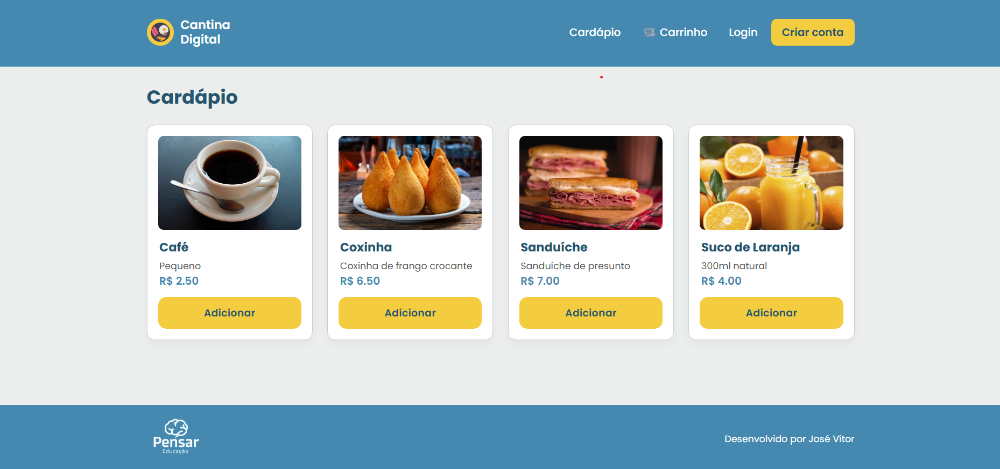
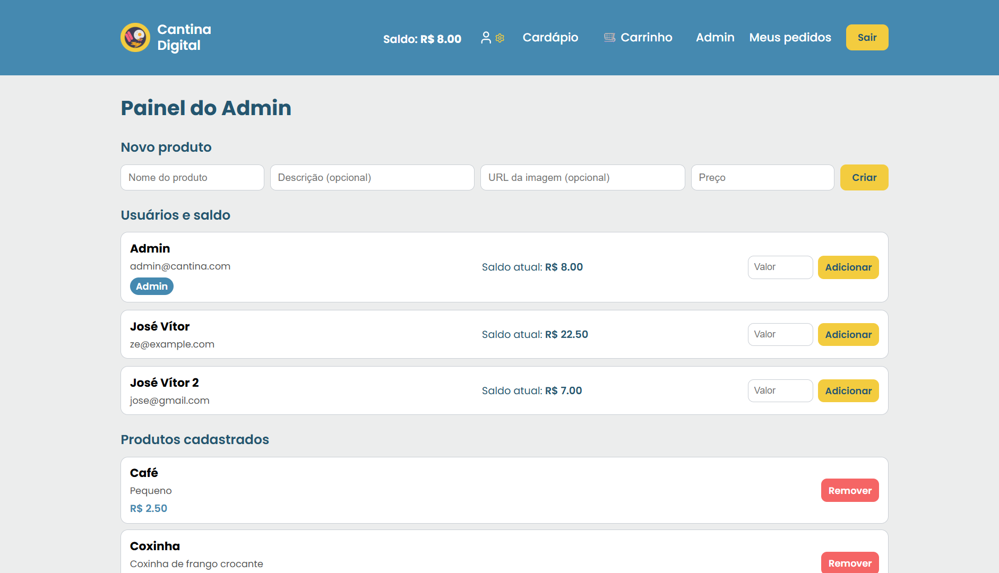

# 🍽️ Cantina Digital — Full Stack Application

<p><b>Uma aplicação completa para gestão de cantina escolar, desenvolvida como desafio técnico para o Grupo Pensar Educação.</b></p>

---

## 📘 Visão Geral

A **Cantina Digital** é uma aplicação Full Stack que moderniza o processo de compra na cantina escolar.
Ela permite que estudantes e funcionários realizem pedidos online, acompanhem seu histórico, utilizem um saldo virtual e interajam com um cardápio totalmente digitalizado.

O sistema implementa autenticação segura com JWT, controle de acesso por papéis (`user` e `admin`), carrinho de compras, histórico de pedidos e um painel administrativo completo, tudo com uma UI moderna inspirada no design institucional do Grupo Pensar Educação.

### Telas da Aplicação: Cardápio vs. Painel Admin

Abaixo estão dois exemplos reais da interface da Cantina Digital:  
à esquerda o **Cardápio** visto pelos usuários comuns, e à direita o **Painel Administrativo**, acessível apenas para admins.

| Tela de Cardápio | Painel Administrativo |
| :---: | :---: |
|  |  |

---

# ⭐ Funcionalidades Principais

## 👤 Autenticação & Segurança

* Registro de usuários com senha hasheada via **bcryptjs**
* Login com **JWT (JSON Web Token)**
* Middleware global de autenticação
* Rota protegida para pedidos
* Controle de permissão baseado em papel (User/Admin)
* Armazenamento seguro do token

## 🛒 Cardápio e Carrinho

* Listagem completa dos produtos
* Cards modernos com preço, descrição e imagem
* Carrinho persistente via Context API
* Toast visual ao adicionar item
* Revisão do pedido antes da finalização

## 💳 Sistema de Saldo

* Todo usuário começa com **R$ 20,00** de saldo inicial para praticidade nos testes
* Saldo é debitado automaticamente ao finalizar pedido
* Admin pode adicionar saldo a qualquer usuário via painel administrativo exclusivo
* Visualização de saldo em tempo real na navbar para fácil informação
  
## 📦 Pedidos

* Criação de pedidos com base no carrinho
* Total calculado automaticamente no backend
* Histórico pessoal do usuário
* Status do pedido:

  * `PENDING`
  * `PREPARING`
  * `READY`
* Atualização de status no painel administrativo

## 🛠 Painel Administrativo (Admin)

Admin pode:

* Criar produtos (com nome, descrição, preço e URL de imagem)
* Remover produtos (com proteção se estiver em pedidos)
* Ver todos os pedidos do sistema
* Atualizar status dos pedidos
* Gerenciar usuários
* Adicionar saldo individualmente

### 🔐 Como acessar o Admin?

O sistema já cria um administrador padrão no primeiro seed.

**Admin padrão:**

```
email: admin@cantina.com
senha: admin123
```

---

# ✨ Tecnologias Utilizadas

## Backend

* **Node.js + Express** - Servidor HTTP eficiente e modular
* **Prisma ORM** - Abstração segura do banco de dados com migrations automáticas
* **SQLite** - Banco de dados leve e sem dependências externas
* **JWT** - Autenticação stateless e segura
* **bcryptjs** - Hashing seguro e conciso de senhas
* **Cors / Middlewares** - Proteção e configuração de headers
* Arquitetura REST separada em routes + middlewares

## Frontend

* **React (Vite)** - Biblioteca moderna para construção de UI com build rápido
* **Context API** - Gerenciamento de estado global (Auth + Cart)
* **Styled Components** - CSS-in-JS para temas dinâmicos e responsivos
* **Axios** - Cliente HTTP com interceptadores automáticos
* **React Router** - Roteamento client-side
* **Lucide React Icons** - Ícones modernos e escaláveis
* Sistema de layout inspirado nos projetos do Grupo Pensar (paleta de cores e organização)

---

# 📂 Estrutura do Projeto

```
Cantina-Digital/
│
├── backend/
│   ├── prisma/
│   │   └── schema.prisma
│   ├── routes/
│   ├── middlewares/
│   ├── server.js
│   └── package.json
│
└── frontend/
    ├── src/
    │   ├── components/
    │   ├── contexts/
    │   ├── pages/
    │   ├── hooks/
    │   ├── styles/
    │   └── App.jsx
    └── package.json
```

---

# ⚙️ Configuração do Backend

## 1. Instale as dependências

```bash
cd backend
npm install
```

## 2. Crie o arquivo `.env`

```
JWT_SECRET="coloque-sua-chave-aqui"
DATABASE_URL="file:./dev.db"
```

**Por segurança:** Para gerar uma chave JWT segura, execute:
```bash
node -e "console.log(require('crypto').randomBytes(32).toString('hex'))"
```

## 3. Migrate

```bash
npx prisma migrate dev
```

## 4. Execute o servidor

```bash
npm start
```

A API ficará em:
**[http://localhost:3333](http://localhost:3333)**

---

# 💻 Configuração do Frontend

## 1. Instale as dependências

```bash
cd frontend
npm install
```

## 2. Crie o `.env`

```
VITE_API_URL=http://localhost:3333
```

## 3. Rode o projeto

```bash
npm run dev
```

Frontend disponível em:
[http://localhost:5173](http://localhost:5173)

---

# 🔒 Autenticação e Fluxo de Segurança

A aplicação segue boas práticas modernas:

### ✔ Senhas hasheadas

Usa **bcryptjs**

### ✔ JWT stateless

Toda rota protegida exige header:

```
Authorization: Bearer <token>
```

### ✔ O front-end só acessa dados do usuário autenticado

* `/orders` sempre retorna **somente pedidos do próprio usuário**

### ✔ Admin tem privilégios extra

Cartões de UI só aparecem se `role === "admin"`
No backend, rotas admin-only exigem middleware especializado.

---

# 📖 Rotas da API

## Auth

| Método | Rota           | Descrição           |
| ------ | -------------- | ------------------- |
| POST   | /auth/register | Registrar usuário   |
| POST   | /auth/login    | Login + retorna JWT |

## Usuários

| Método | Rota              | Descrição            |
| ------ | ----------------- | -------------------- |
| PATCH  | /users/:id/credit | Admin adiciona saldo |

## Produtos

| Método | Rota          | Descrição          |
| ------ | ------------- | ------------------ |
| GET    | /products     | Lista produtos     |
| GET    | /products/:id | Detalhes           |
| POST   | /products     | Admin cria produto |
| DELETE | /products/:id | Admin remove       |

## Pedidos

| Método | Rota               | Descrição             |
| ------ | ------------------ | --------------------- |
| POST   | /orders            | Criar pedido          |
| GET    | /orders            | Histórico do usuário  |
| GET    | /orders/all        | Admin vê todos        |
| PATCH  | /orders/:id/status | Admin atualiza status |

---

# 🏛️ Arquitetura

### 🔹 Separação clara de responsabilidades:

* Auth
* Users
* Orders
* Products

### 🔹 Prisma para segurança e integridade do BD:

* Relações fortes
* Cascading controlado
* Restrições de remoção inteligente

### 🔹 Frontend com Context API:

* Evita prop drilling
* Código mais limpo e escalável

### 🔹 Layout consistente via ThemeProvider:

* Paleta de cores do Grupo Pensar (Azul #4589B0 e Amarelo #F3CC3F), com retoques sutis
* Design moderno e responsivo para fácil usabilidade

### 🔹 UX refinada:

* Toast ao adicionar item como indicador consistente
* Icone de usuário com engrenagem para Admin para fácil diferenciação visual
* Navegação mobile com menu expansível, com adaptabilidade para diferentes telas

---

# 👨‍💻 Autor

**José Vítor**

---


